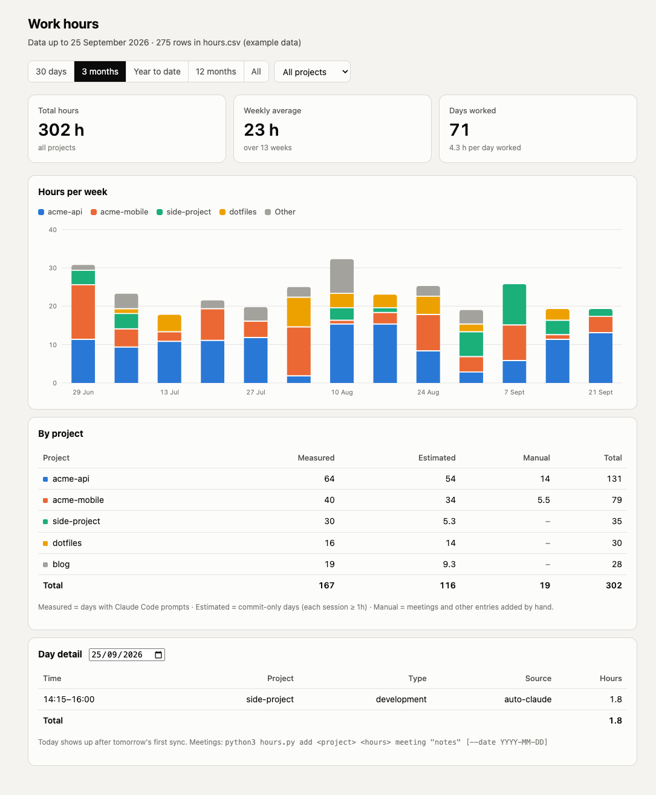

# Work hours

A zero-dependency work-hours tracker. It reconstructs how long I worked on each project from signals I already leave behind (git commits and Claude Code sessions), lets me add what those signals miss (meetings, calls), and shows it all in a single static dashboard.



- **One Python file**, standard library only.
- **One CSV** as the source of truth: plain text, easy to diff and edit by hand.
- **One HTML file** for the dashboard: open it with a double click, no server, no build step.

## How it works

```
Claude Code prompts ─┐
                     ├─▶ hours.py sync ─▶ hours.csv ─▶ hours-data.js ─▶ dashboard.html
git commits ─────────┘                       ▲
                                             │
            hours.py add … (meetings, calls) ┘
```

### 1. Collecting activity

`hours.py sync` scans every project folder under `~/Desktop` (override with `HOURS_ROOT`):

- **Claude Code sessions**: Claude Code keeps a JSONL log of every conversation in `~/.claude/projects/`, one directory per working folder. The script reads the timestamps of the prompts I typed and skips tool results, which are logged as user messages too.
- **git commits**: `git log --all` in each repository, keeping only commits whose author email is mine (`HOURS_EMAILS`, comma-separated; defaults to `git config --global user.email`).

### 2. Turning timestamps into sessions

Timestamps are grouped per project and per day, then merged into sessions. A new session starts when the gap between two events is too long. The rules depend on how dense the data is:

| Day has… | Source | Gap that splits sessions | Adjustments |
|---|---|---|---|
| Claude Code prompts (commits merged in) | `auto-claude` — **measured** | 1 h | each session starts 15 min before the first prompt |
| commits only | `auto-git` — **estimated** | 2 h | each session lasts at least 1 h |

A project never gets both rules on the same day, so time is not counted twice. Two different projects worked on in parallel are both counted.

### 3. Append-only log

- Only **closed days** are written (today is skipped until tomorrow), and a `(day, project)` pair that is already in the CSV is never rewritten. Claude Code deletes old logs after about 30 days, but rows already saved stay.
- Rows can be fixed by hand. If an automatic row is moved to another project, put `from <original project>` in `notes` so the next sync won't recreate it.
- I run `sync` automatically from a Claude Code `SessionStart` hook, so the log updates itself.

### 4. Manual entries

Meetings, calls and any work without commits:

```sh
python3 hours.py add acme-api 1.5 meeting "client call"              # today
python3 hours.py add acme-api 3 meeting "workshop" --date 2026-09-26
```

### 5. Dashboard

`dashboard.html` is a static page. A `file://` page cannot `fetch` a CSV, so every write also regenerates `hours-data.js` (`window.HOURS = [...]`), which the page loads with a `<script>` tag. Reload the page to see new data.

- hours per day, week or month (picked from the period, or chosen by hand), stacked by project (top 4 + "Other")
- filters: last 30 days, 3 months, year to date, 12 months, all; per project
- per-project table split into measured / estimated / manual
- day detail: every session of a given day (click a bar in the daily view)

Without `hours-data.js`, the page falls back to `example-data.js` (fake data), which is what the screenshot shows.

## CSV format

| column | values |
|---|---|
| `date` | `YYYY-MM-DD` |
| `start`, `end` | `HH:MM`, empty for manual entries |
| `hours` | decimal, e.g. `1.50` |
| `project` | folder name |
| `type` | `development`, `meeting`, `review`, `study`, `other` |
| `source` | `auto-claude`, `auto-git`, `manual` |
| `notes` | free text |

## Usage

```sh
python3 hours.py sync   # log past days
python3 hours.py test   # self-check of the session logic
open dashboard.html
```

`hours.csv` and `hours-data.js` hold personal data and are git-ignored.

## License

MIT
